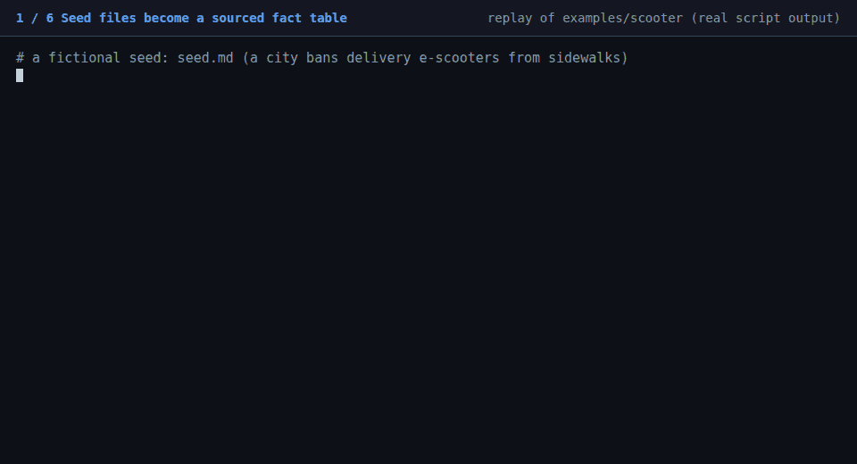

# stakeholder-rehearsal

**Rehearse how a situation may unfold by simulating the people involved. An agent skill for Claude Code. No server, no API key, no database.**

Give it seed material (a news item, a policy draft, a launch plan, a crisis, a story). It builds a sourced fact table and a stakeholder map, writes personas, lets sub-agents act round by round on a simulated social feed, interviews a few of them, and writes a scenario report in which **every quote is machine-checked against the simulation log**.



*Replay of the bundled example run. Every command output in the GIF is real script output; `docs/demo/` regenerates it.*

> It produces scenarios and the mechanisms behind them, not probabilities. Read [Limits](#limits) before showing a result to anyone.

## Why this exists

Heavy swarm-simulation engines need servers, API keys for several services, and thousands of agent calls. Most of what a decision-maker wants from a rehearsal is smaller: *who speaks first, which framing sticks, where a statement backfires, what changes if I add one variable.* This skill does that with a handful of agents, a plain-file run folder you can read and diff, and a report you can audit.

| | stakeholder-rehearsal | server-based simulation engines |
|---|---|---|
| Setup | copy one folder | servers, several API keys, graph database |
| Cost of a run | 20-100 sub-agent calls (`lite`), counted before you start | hundreds to thousands |
| State | plain files (`facts.md`, `rounds/*.jsonl`, `report.md`) | databases |
| Report evidence | quotes verified against the log by script | by prompt only |
| Scale | 6-20 agents | thousands of agents |

If you need crowd-scale emergent behaviour, use an engine built for it. If you need a fast, inspectable rehearsal, use this.

## Install

```bash
npx skills add <owner>/stakeholder-rehearsal --skill stakeholder-rehearsal
```

or copy `skills/stakeholder-rehearsal/` into `~/.claude/skills/` (or a project's `.claude/skills/`). Requires Python 3 for the helper scripts (standard library only). Developed and tested with Claude Code; other agent runtimes that load `SKILL.md` skills and can launch sub-agents should work but are untested.

## Use

Ask in plain words, with your seed files in the working directory:

> Simulate how the stakeholders react to `policy.md` over the first three days. Lite run.

The agent follows `SKILL.md`: it writes a brief, tells you how many sub-agent calls the run needs and waits for a go-ahead above 60, then works in `rehearsal/<slug>/`:

```
facts.md  ontology.md  cast.json  cast/a01.md …   what the world is made of
config.json                                       rounds, hours, opening posts, injections
turns/RR/*.prompt.md *.json                       what each agent saw and chose
rounds/00.jsonl 01.jsonl …                        the append-only log (the only evidence)
interviews/a06.md                                 post-run answers
report.md                                         the scenario report
```

Change one variable (an apology, a leak, a delay) by copying the folder, editing `injections`, and re-running with the same seed. The report compares the branches.

## How it works

```
seed files ─► facts.md (sourced) ─► actor types ─► personas ─► config
                                                                  │
        report.md ◄─ verify_quotes.py ◄─ evidence lookups ◄─ rounds of sub-agent turns ─► interviews
```

- **Facts first.** Every fact has an id and a quoted source; anything invented is tagged `[assumed]`.
- **Stance lives in the persona text**, not in numeric sentiment knobs that nothing reads.
- **Independent turns.** One sub-agent call per active agent per round, each seeing only its persona, its own history and a feed built from earlier rounds.
- **Reproducible activation.** `pick_agents.py` draws who acts from (seed, round).
- **Audited report.** Claims are tagged `[seed]`, `[simulated]` or `[inferred]`; `verify_quotes.py` fails if a blockquote is not inside the log entry it cites, or if the report does not open with the standard notice (one model played everyone; not a forecast; not calibrated).
- **A control.** `make_baseline.py` prepares a single plain call on the same seed with no simulation, and the report says what the run added over it. In the example, the baseline confidently predicted the opposite of what the run showed.
- **Cost before you start.** `estimate_cost.py` counts the sub-agent calls for a seed; above 60 the skill asks for a go-ahead.

A complete run is in [`skills/stakeholder-rehearsal/examples/scooter/`](skills/stakeholder-rehearsal/examples/scooter) (fictional city, 6 agents, 4 rounds, 2 interviews). Excerpt from its report:

> The injected post that two councillors question whether the 40 km of lanes is funded drew no reply, quote, like or repost from anyone in the log. [simulated] … This suggests the "date versus missing lanes" framing is stickier than a "who pays" framing for the audience in this cast. It does not show that a funding story would fail with a different cast. [inferred]

## What testing found

Running the method end to end on the example surfaced problems that are now fixed in the skill, and they show what to watch for in your own runs:

- Sub-agent reply text is a summary and may omit the action's content, so agents write their action to a file and the scripts read the file.
- Agents invent specifics (the example run invented a year that three agents then repeated). Turn prompts forbid it and the report rules require checking details against `facts.md`.
- Interview answers can contradict the log (one agent claimed to have published a story another agent published). Treat them as stated reasons, not facts.

## Limits

- The agents are one model playing roles. They share its priors and are more articulate and consistent than a real crowd; silence, apathy and chaos are under-represented.
- A cast of 6-20 cannot show crowd effects. Results vary between seeds: for a decision that matters, run two or more and report only what repeats.
- No calibration against real outcomes exists. This is a rehearsal tool, not a forecast.
- Tested on small models, one platform style per run, and a handful of scenarios. Do not simulate private individuals.

## Development

```bash
python3 -m unittest discover -s tests -v     # 34 tests, standard library only
# regenerate the demo GIF (needs ffmpeg and Playwright):
python3 docs/demo/build_scenes.py . /tmp/scenes.json && NODE_PATH=<dir with playwright> node docs/demo/render.mjs /tmp/scenes.json /tmp/frames
# then: ffmpeg -f concat -safe 0 -i /tmp/frames/list.txt -vf "fps=10,split[a][b];[a]palettegen=max_colors=24:stats_mode=diff[p];[b][p]paletteuse=dither=none" -loop 0 docs/demo.gif
python3 skills/stakeholder-rehearsal/scripts/verify_quotes.py skills/stakeholder-rehearsal/examples/scooter
```

Contributions that add scenarios with verified reports, or compare results across models, are the most useful.

## Credits and license

MIT, see [LICENSE](LICENSE). The workflow idea follows [MiroFish](https://github.com/666ghj/MiroFish) (AGPL-3.0); this project is an independent reimplementation and contains none of its code or prompt text. Details in [`skills/stakeholder-rehearsal/SOURCE.md`](skills/stakeholder-rehearsal/SOURCE.md).
